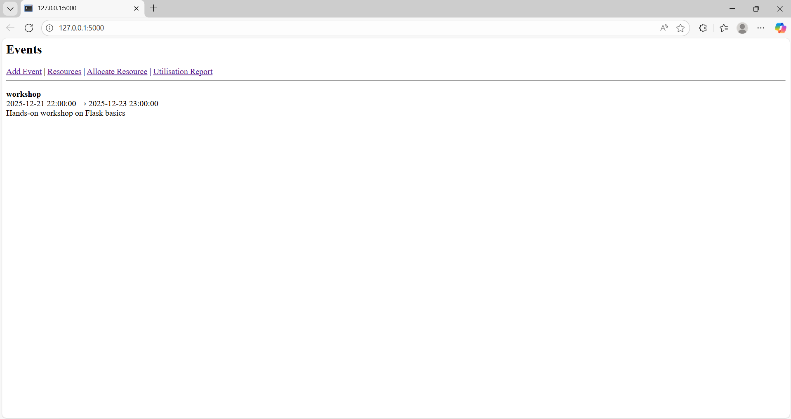
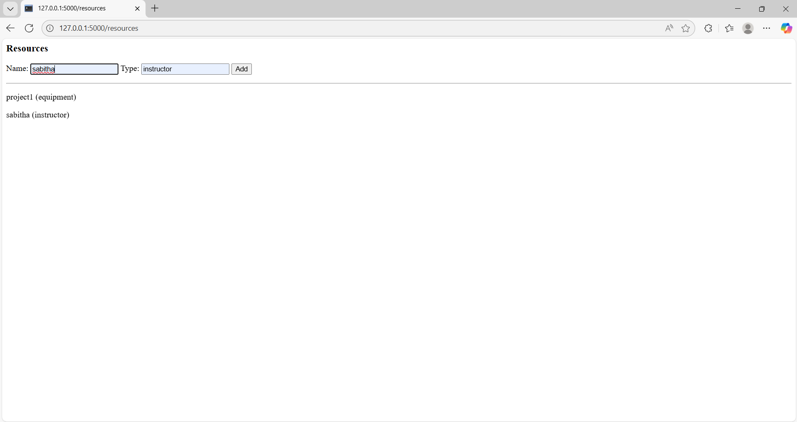
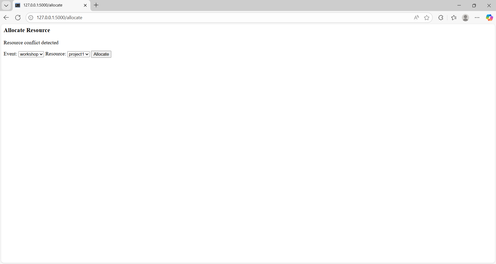
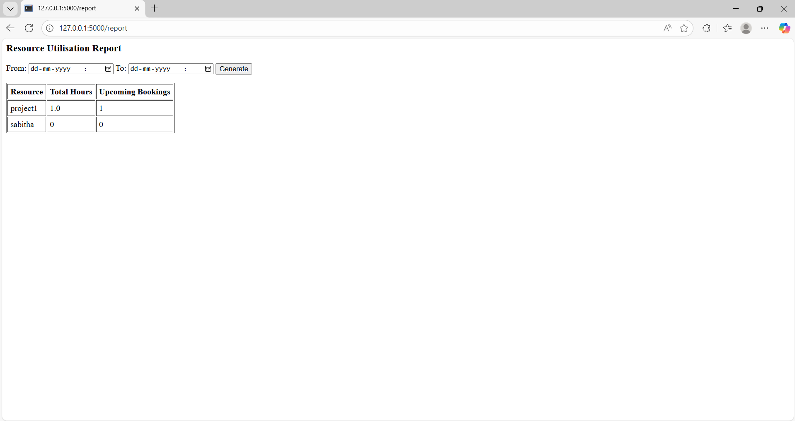

# Flask Event Scheduling & Resource Allocation System

This repository contains screenshots and a demo video of the Flask Event Scheduling & Resource Allocation System.

### Event Management

### Resource 

### Resource Allocation

### Resource Utilization Report

### Demo Video
[Watch Demo Video](viedo.MP4) 
 Will this work
